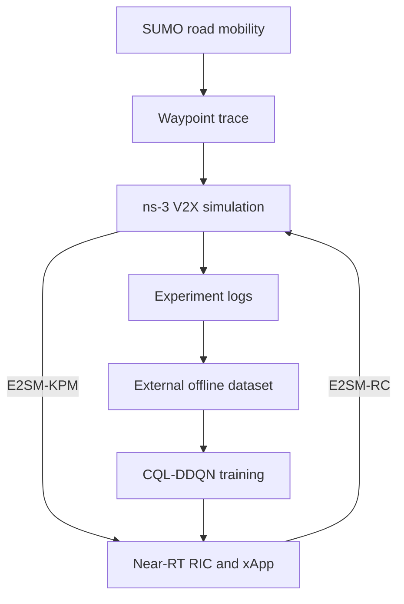

# Unified Framework for O-RAN-Based Vehicular Handover

This repository provides an executable research framework for studying
handover in O-RAN-based vehicle-to-everything (V2X) networks. It extends
[ns-O-RAN](https://openrangym.com/tutorials/ns-o-ran) with road-constrained
vehicle mobility, an O-RAN control path for simulator-side handover execution,
and an offline reinforcement-learning handover xApp.

The framework is intended for simulation and reproducible systems research. It
is not a production O-RAN deployment.

The repository also contains the offline handover-policy training code used by
[HONOR: O-RAN-compliant Handover Optimization in Vehicular Networks via Offline
RL](https://ieeexplore.ieee.org/document/11579080). If you use that training
implementation, please cite the HONOR paper as described in [Citation](#citation).

## Research scope

The implementation addresses three integration requirements:

- **R1 — Executable O-RAN control loop:** simulated RAN measurements are sent as
  E2SM-KPM indications to a near-RT RIC; the xApp returns an E2SM-RC command;
  the command is translated into a handover in the simulator.
- **R2 — Inspectable xApp pipeline:** the deployed model definition, inference
  path, offline CQL-DDQN training code, dataset interface, and a pretrained
  checkpoint are provided.
- **R3 — Road-constrained mobility:** vehicle positions generated by SUMO can
  be converted into waypoint traces and replayed in ns-3.

The reference scenario is
[`MultiVehicleURLLC.cc`](O-RAN-V2X-simulation/scratch/MultiVehicleURLLC.cc). It
creates one LTE anchor and ten mmWave roadside units (RSUs), replays multiple
vehicle trajectories, generates URLLC traffic, exports KPMs, and accepts
xApp-triggered handovers.

## Architecture



The online loop is KPM reporting → xApp decision → RC message → simulator-side
handover execution. The offline path trains a policy from previously collected
state, action, and outcome data, then deploys the resulting checkpoint in the
xApp container.

## Repository layout

| Path | Purpose |
| --- | --- |
| `O-RAN-V2X-simulation/` | ns-3/mmWave/ns-O-RAN simulation tree with the V2X handover extensions |
| `O-RAN-V2X-simulation/scratch/MultiVehicleURLLC.cc` | Reference multi-vehicle URLLC scenario |
| `O-RAN-V2X-simulation/sumo/TraceFileTransfer.py` | SUMO FCD XML to ns-3 waypoint converter |
| `sample-xapp/` | Python inference agent and included pretrained checkpoint |
| `xapp-sm-connector/` | C++ connector between the Python agent and the near-RT RIC |
| `CQL_DDQN.py` | Offline CQL-DDQN training implementation |
| `docs/DATASET_FORMAT.md` | External training-dataset interface |

## Reproducibility and data availability

The repository includes the simulation implementation, xApp and connector,
mobility converter, training code, and a pretrained checkpoint. The following
items remain external:

- the ColO-RAN near-RT RIC;
- `e2sim` and the ns-O-RAN `oran-interface` module;
- a SUMO network/route definition or another SUMO scenario used to generate
  mobility;
- the raw experiment logs, preprocessing pipeline, and exact training dataset
  used for the paper.

The public dataset interface is documented in
[`docs/DATASET_FORMAT.md`](docs/DATASET_FORMAT.md). Because the paper dataset is
not included, the supplied policy can be deployed and evaluated, and the
training implementation can be run on compatible data, but the exact paper
training run cannot be reconstructed from this repository alone.

## Prerequisites and validated environments

Follow the upstream [ns-O-RAN installation
tutorial](https://openrangym.com/tutorials/ns-o-ran) for the base platform. Its
documented Ubuntu 20.04 setup requires Docker and the following build packages.
The independently recorded reference-host environment is:

| Component | Recorded version or value |
| --- | --- |
| Host platform | Ubuntu 22.04 LTS (Jammy), x86_64 |
| ns-3 simulation tree | `3.38.rc1` |
| Docker | `28.2.2` |
| G++ | `11.4.0` |
| CMake | `3.22.1` |
| SUMO | `1.25.0` |
| `SUMO_HOME` | `/usr/share/sumo` |

Training and xApp inference run in separate Python environments:

| Component | Training host | xApp container |
| --- | --- | --- |
| Python | `3.10.12` | `3.6.9` |
| PyTorch | `2.9.0+cu128` | `1.10.2+cu102` |
| NumPy | `2.2.6` | `1.19.5` |
| SciPy | `1.15.3` | `1.5.4` |
| pandas | `2.3.3` | `1.1.5` |
| TensorBoard | `2.20.0` | Not required by the xApp |

The xApp image inherits its Python 3.6 environment from an Ubuntu 18.04 base
image. [`sample-xapp/requirements.txt`](sample-xapp/requirements.txt) pins the
recorded deployment-package releases. The deployed agent explicitly performs
inference on the CPU, so the reference PyTorch `+cu102` wheel is not a runtime
requirement; the requirements file pins the common `1.10.2` release.

The exact commits of the external near-RT RIC, `e2sim`, and `oran-interface`
dependencies have not yet been independently verified.

```bash
sudo apt-get update
sudo apt-get install -y \
  build-essential git cmake libsctp-dev autoconf automake libtool \
  bison flex libboost-all-dev g++ python3 python3-pip python3-venv \
  libeigen3-dev
```

SUMO is needed to create new road-mobility traces, but it is not required to
compile or replay an existing trace.

## 1. Set up the near-RT RIC and xApp

Clone and start the upstream RIC:

```bash
git clone -b ns-o-ran https://github.com/wineslab/colosseum-near-rt-ric
cd colosseum-near-rt-ric/setup-scripts
./import-wines-images.sh
./setup-ric-bronze.sh
```

Clone this repository in another directory:

```bash
git clone https://github.com/HapCommSys/unified-framework-for-vehicular-handover.git
```

Before building the xApp image, replace the two upstream source directories in
`colosseum-near-rt-ric/setup/` with the versions from this repository. The
following example first preserves the upstream directories as backups:

```bash
export FRAMEWORK_ROOT=/absolute/path/to/unified-framework-for-vehicular-handover
export RIC_ROOT=/absolute/path/to/colosseum-near-rt-ric

mv "$RIC_ROOT/setup/sample-xapp" "$RIC_ROOT/setup/sample-xapp.upstream"
mv "$RIC_ROOT/setup/xapp-sm-connector" "$RIC_ROOT/setup/xapp-sm-connector.upstream"
cp -a "$FRAMEWORK_ROOT/sample-xapp" "$RIC_ROOT/setup/"
cp -a "$FRAMEWORK_ROOT/xapp-sm-connector" "$RIC_ROOT/setup/"
```

Build the connector for the reference topology. The `rsu` argument is required:
it selects all 11 E2 nodes listed in `rsu_list.txt`—one LTE anchor followed by
ten mmWave RSUs. The upstream `start-xapp-ns-o-ran.sh` passes `ns-o-ran`, whose
default five-gNB list does not match this scenario.

```bash
cd "$RIC_ROOT/setup-scripts"
docker rm -f sample-xapp-24 2>/dev/null || true
docker image rm sample-xapp:latest 2>/dev/null || true
./setup-sample-xapp.sh rsu
```

Start the xApp in a dedicated terminal:

```bash
docker exec -it sample-xapp-24 /home/sample-xapp/run_xapp.sh
```

By default, the agent loads
`/home/sample-xapp/model/ICQL_HO_Cosine_Lite_20000.pth`. An alternative path can
be supplied with the `XAPP_MODEL_PATH` environment variable.

## 2. Install e2sim

Build and install the `e2sim` library as described by ns-O-RAN:

```bash
git clone https://github.com/wineslab/ns-o-ran-e2-sim oran-e2sim
cd oran-e2sim/e2sim
mkdir build
./build_e2sim.sh 3
```

Log level `3` enables verbose E2 debugging. `e2sim` is installed as a dependency
used by the ns-O-RAN module; it is not launched as a separate simulator process
for this experiment.

## 3. Build the V2X simulation

The simulation tree is already included in this repository. Do not clone a
second `ns-o-ran-ns3-mmwave` tree over it. Install the external O-RAN module in
the expected `contrib` path and then build ns-3:

```bash
cd "$FRAMEWORK_ROOT/O-RAN-V2X-simulation/contrib"
git clone -b master https://github.com/o-ran-sc/sim-ns3-o-ran-e2 oran-interface

cd "$FRAMEWORK_ROOT/O-RAN-V2X-simulation"
./ns3 configure --enable-examples --enable-tests
./ns3 build
```

If CMake cannot locate `e2sim`, verify that `build_e2sim.sh` completed its
package installation and that `ldconfig` was run as part of that script.

## 4. Generate a mobility trace

Use any valid SUMO scenario to export [floating-car data
(FCD)](https://sumo.dlr.de/docs/Simulation/Output/FCDOutput.html), then convert it
to the format consumed by `MultiVehicleURLLC.cc`:

```bash
cd "$FRAMEWORK_ROOT/O-RAN-V2X-simulation"
sumo -c /path/to/scenario.sumocfg --fcd-output /tmp/fcdoutput.xml
python3 sumo/TraceFileTransfer.py /tmp/fcdoutput.xml sumo/traceFile.txt
```

The converter retains each SUMO vehicle's entry and departure times and writes
blank-line-separated `time x y` waypoint blocks. See
[`O-RAN-V2X-simulation/sumo/README.md`](O-RAN-V2X-simulation/sumo/README.md) for
the exact format.

`straight6_ref.sumocfg` is retained as a configuration template, but its
referenced `.net.xml` and `.rou.xml` inputs are not included.

## 5. Run the closed-loop example

Keep the RIC and xApp running, and launch the reference scenario from a third
terminal:

```bash
cd "$FRAMEWORK_ROOT/O-RAN-V2X-simulation"
./ns3 run "scratch/MultiVehicleURLLC.cc \
  --traceFile=sumo/traceFile.txt \
  --e2TermIp=10.0.2.10 \
  --handoverMode=NoAuto \
  --enableE2FileLogging=false"
```

`10.0.2.10` is the default E2 termination address in the upstream local RIC
setup. Change `--e2TermIp` if the RIC is hosted elsewhere.

Useful observations during a run include:

```bash
docker logs e2term -f --since=1s 2>&1 | grep gnb:
docker exec sample-xapp-24 tail -f /home/xapp-input.log
```

The xApp writes handover decisions to
`/home/xapp-handover_ICQL_HO_Cosine_Lite_20000.log` inside the container.

## 6. Train an offline handover policy

[`CQL_DDQN.py`](CQL_DDQN.py) provides the offline reinforcement-learning
training implementation associated with HONOR. It combines conservative
Q-learning, assignment-constrained action selection, and Lagrangian penalties
for latency and reliability constraints. If you use this training code, please
cite [the HONOR paper](#offline-reinforcement-learning-training-code).

Training and deployment use different Python environments. Install the training
dependencies on the training host. `requirements-training.txt` pins the
recorded training dependencies; the reference PyTorch installation identified
itself as the CUDA-enabled `2.9.0+cu128` build, while the requirements file pins
the corresponding `2.9.0` release so an appropriate wheel can be selected for
the target platform:

```bash
cd "$FRAMEWORK_ROOT"
python3 -m venv .venv
source .venv/bin/activate
python3 -m pip install --upgrade pip
python3 -m pip install -r requirements-training.txt
```

Prepare an external dataset according to
[`docs/DATASET_FORMAT.md`](docs/DATASET_FORMAT.md), then run:

```bash
python3 CQL_DDQN.py \
  --dataset-root /absolute/path/to/Dataset \
  --run-name ICQL_HO_Cosine_Lite \
  --episodes 20000 \
  --checkpoint-interval 4000
```

Checkpoints are written to `model/` by default and contain
`agent_target_state_dict`, which is the entry consumed by the deployed xApp.
TensorBoard logs are written to `logs/CQL_DDQN/`:

```bash
tensorboard --logdir logs/CQL_DDQN
```

To deploy another checkpoint without changing Python source, copy it into the
xApp container and set `XAPP_MODEL_PATH`:

```bash
docker cp model/ICQL_HO_Cosine_Lite_20000.pth \
  sample-xapp-24:/home/sample-xapp/model/ICQL_HO_Cosine_Lite_20000.pth

docker exec -e XAPP_MODEL_PATH=/home/sample-xapp/model/ICQL_HO_Cosine_Lite_20000.pth \
  -it sample-xapp-24 /home/sample-xapp/run_xapp.sh
```

## Troubleshooting

- **The xApp waits indefinitely for a complete state:** confirm that the xApp
  was built with `./setup-sample-xapp.sh rsu`, not `ns-o-ran`, and that all 11
  node IDs in `xapp-sm-connector/init/rsu_list.txt` are connected.
- **`oran-interface` is missing during configuration:** clone it into
  `O-RAN-V2X-simulation/contrib/oran-interface` before running `./ns3 configure`.
- **The scenario reports a mobility-trace error:** regenerate the file with
  `TraceFileTransfer.py`; each vehicle needs at least two strictly increasing
  timestamps spanning more than 0.2 seconds.
- **The xApp checkpoint is not found:** rebuild the Docker image after replacing
  `sample-xapp`, or pass an existing in-container path through
  `XAPP_MODEL_PATH`.
- **Training loads no transitions:** verify `--dataset-root` and the directory
  and file names documented in `docs/DATASET_FORMAT.md`.

## Citation

### Unified vehicular-handover framework

Citation coming soon.

### Offline reinforcement-learning training code

If you use [`CQL_DDQN.py`](CQL_DDQN.py) or the associated offline
reinforcement-learning training implementation, please cite:

> Y. Wang, Y. Yang, M. Ma, M. Attawna, F. H. P. Fitzek, and G. T. Nguyen,
> "HONOR: O-RAN-compliant Handover Optimization in Vehicular Networks via
> Offline RL," in *2026 IFIP Networking Conference (IFIP Networking)*, 2026,
> pp. 1-9, doi: 10.23919/IFIPNetworking70592.2026.11579080.

[IEEE Xplore](https://ieeexplore.ieee.org/document/11579080) |
[DOI](https://doi.org/10.23919/IFIPNetworking70592.2026.11579080)

```bibtex
@inproceedings{wang2026honor,
  author    = {Yizhou Wang and Yushan Yang and Mingyu Ma and Mahdi Attawna
               and Frank H. P. Fitzek and Giang T. Nguyen},
  title     = {{HONOR}: {O-RAN}-compliant Handover Optimization in Vehicular
               Networks via Offline {RL}},
  booktitle = {2026 IFIP Networking Conference (IFIP Networking)},
  year      = {2026},
  pages     = {1--9},
  doi       = {10.23919/IFIPNetworking70592.2026.11579080},
  url       = {https://ieeexplore.ieee.org/document/11579080}
}
```

## Upstream projects and licensing

This work builds on the following upstream projects:

- [ns-O-RAN / OpenRAN Gym](https://openrangym.com/tutorials/ns-o-ran)
- [ColO-RAN near-RT RIC](https://github.com/wineslab/colosseum-near-rt-ric)
- [ns-O-RAN e2sim](https://github.com/wineslab/ns-o-ran-e2-sim)
- [O-RAN ns-3 interface](https://github.com/o-ran-sc/sim-ns3-o-ran-e2)
- [SUMO](https://eclipse.dev/sumo/)

Licensing is component-specific:

- The ns-3 simulation tree retains its upstream GPL-2.0 license in
  [`O-RAN-V2X-simulation/LICENSE`](O-RAN-V2X-simulation/LICENSE).
- Files inherited from the xApp service-model connector retain their original
  Apache-2.0 notices.
- A license for newly authored project code has not yet been declared.

No repository-wide license should be inferred. Existing upstream copyright and
license notices remain authoritative for their respective components.
